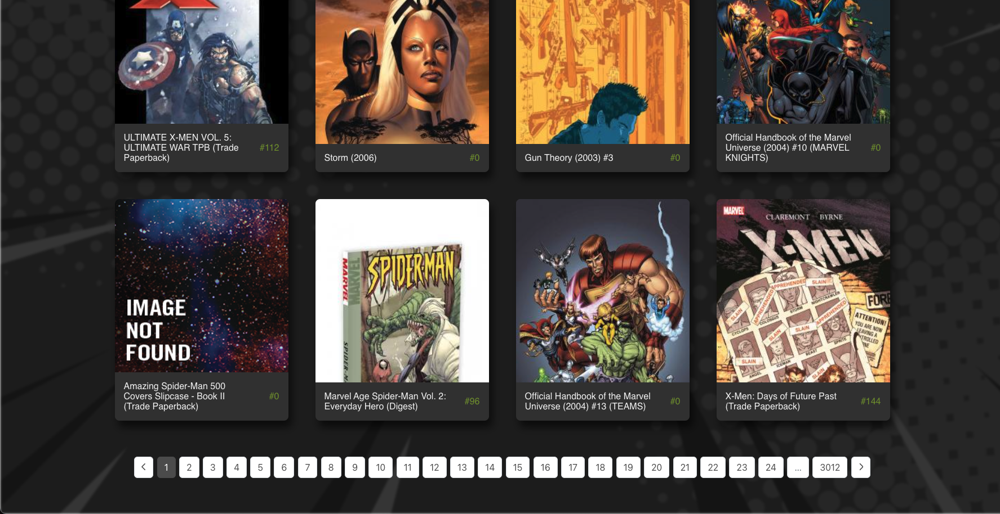
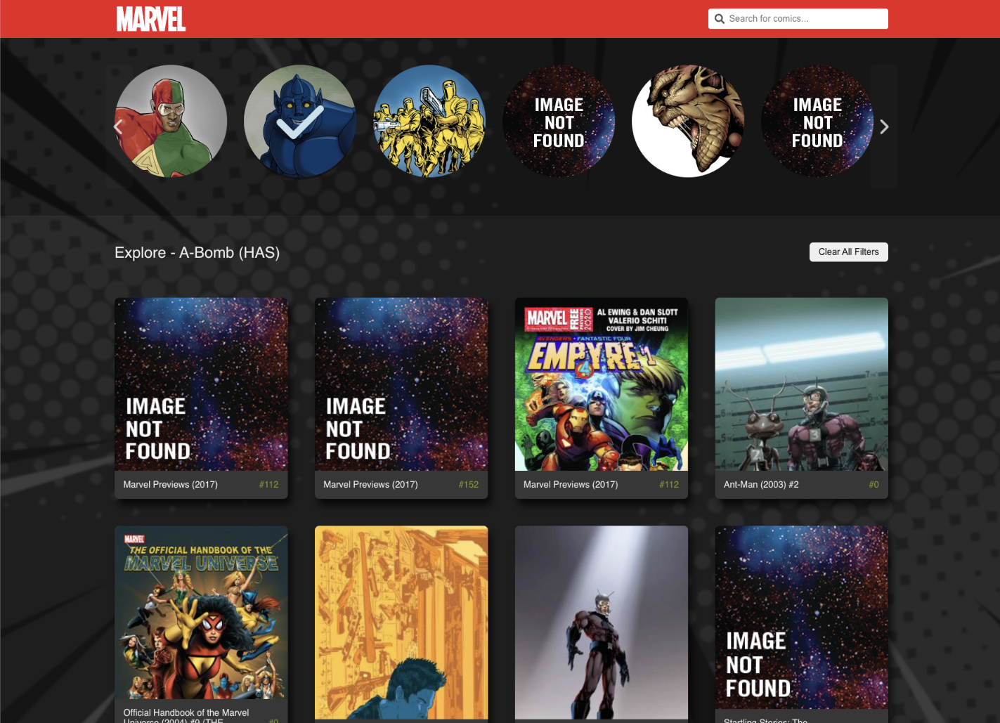
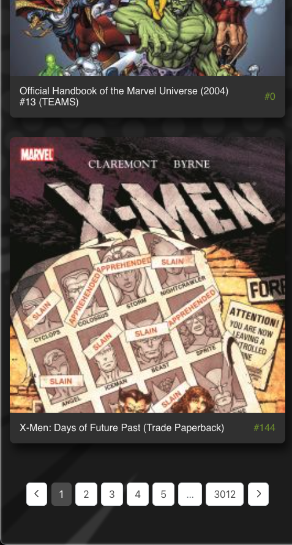
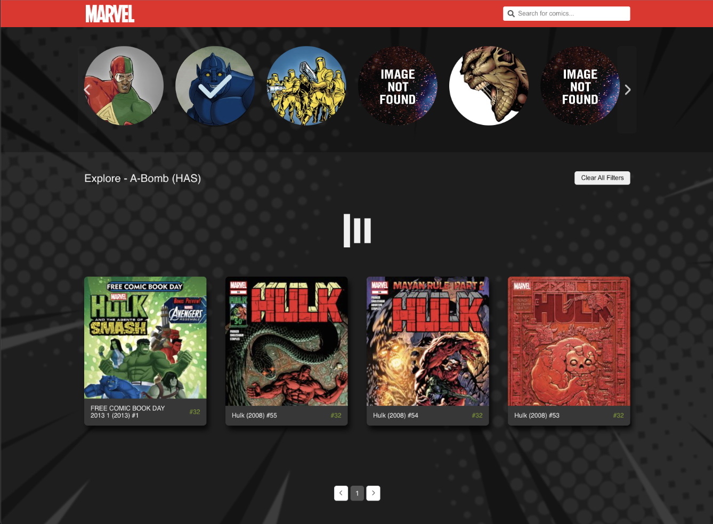
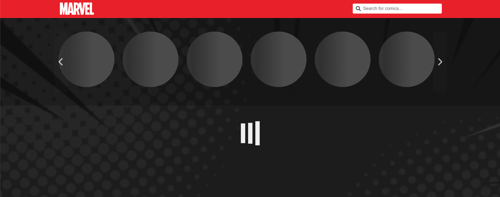
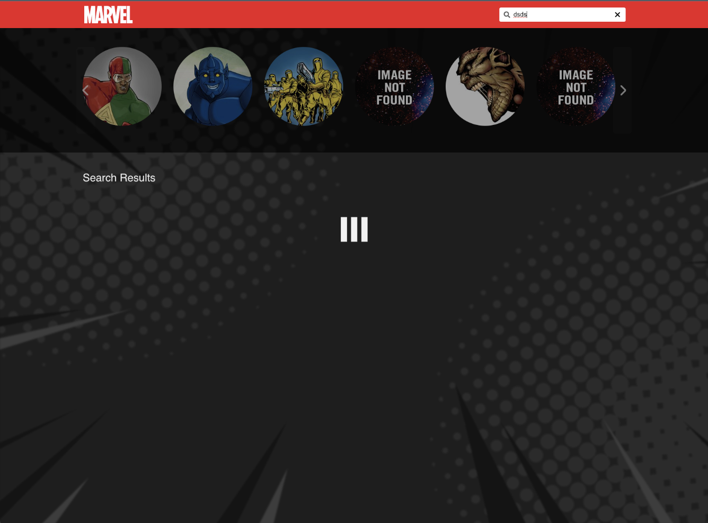
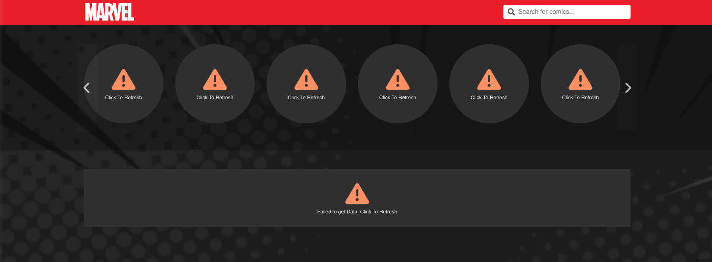

<a name="readme-top"></a>

<!-- PROJECT LOGO -->
<br />
<div align="center">
  <h3 align="center">Marvel Comics Site</h3>

  <p align="center">
Checkout all your favourite comics
    <br />
    <br />
    <a href="https://boisterous-semifreddo-52bf6e.netlify.app/">View Demo</a>
    ·
    <a href="https://github.com/chickoocoutinho/react-flow-example/issues/new?labels=bug&template=bug-report---.md">Report Bug</a>
    ·
    <a href="https://github.com/chickoocoutinho/react-flow-example/issues/new?labels=enhancement&template=feature-request---.md">Request Feature</a>
  </p>
</div>

<!-- TABLE OF CONTENTS -->
<details>
  <summary>Table of Contents</summary>
  <ol>
    <li>
      <a href="#about-the-project">About The Project</a>
      <ul>
        <li><a href="#built-with">Built With</a></li>
         <li><a href="#prerequisites">Prerequisites</a></li>
        <li><a href="#installation">Installation</a></li>
      </ul>
    </li>
    <li>
      <a href="#screenshots">Screenshots</a>
</li>
    <li><a href="#documentation">Documentation</a> 
   </li>

###

  </ol>
</details>

<!-- ABOUT THE PROJECT -->

## About The Project

### Built With

-   React.js
-   react-query
-   react-window
-   clsx
-   CSS modules

### Prerequisites

This is an example of how to list things you need to use the software and how to install them.

-   node
    ```
    v>=16.0.0
    ```
-   npm
    ```sh
    npm install npm@latest -g
    ```

### Installation

1. Clone the repo
    ```sh
    git clone https://github.com/chickoocoutinho/react-flow-example
    ```
2. Install NPM packages
    ```sh
    npm install
    ```
3. To run the project
    ```sh
     npm run dev
    ```

<p align="right">(<a href="#readme-top">back to top</a>)</p>

<!-- USAGE EXAMPLES -->

## Screenshots

### Desktop View


#### Pagination



#### Selected Character UI



### Mobile View

|  |  |
| ------------------------------------------------------- | --------------------------------------------------------- |

### Loading State



#### Loading State For Characters and Comics

Skeletal loading UI used for characters component. This is give the user better feedback during infinite loading.




### Error State



## Documentation

### Infinite Scroll Carousel (Character Select)

-   `useInfiniteQuery` from react-query is used to hmake API calls and handle Infinite loading logic.
-   Since the component has infinite scroll, it may slow down the webpage when there are many characters loaded.
    -   **Solution**
    -   Virtualization is implemented used react-window. We only rendering what is visible to the user (and a buffer of elements). This reduces the number of elements rendered.
    -   As the user scrolls more elements are rendered and the older ones are unmounted.
-   A skeletal loading UI is used to give the user a perception that his/her data is loading faster.

### ComicDataContext

-   All logic to get data from server, handle filters etc is present in this component
-   This allows us to keep all business logic in one place.

### Custom Hooks

#### useDebouncedQuery

-   This hook adds debounced functionality to the useQuery hook from react-query.
-   User to to reduce the number of API alls made to the server when the user uses the search of filters.
-   Debouncing is based on the `queryKey`
-   Debouncing is disabled when `debounceOn` is set to false

### Filters and Search

#### Search Component

-   Search bar state is decoupled from the parent state.
-   This reduces the number of unnecessary rerenderes.
-   The sync between the search bar and its parent is debounced.
-   When the user searches any title,
    -   Character Select is disabled
    -   Selected Characters are set to null

#### Filters

-   Users can select one or more Characters.
